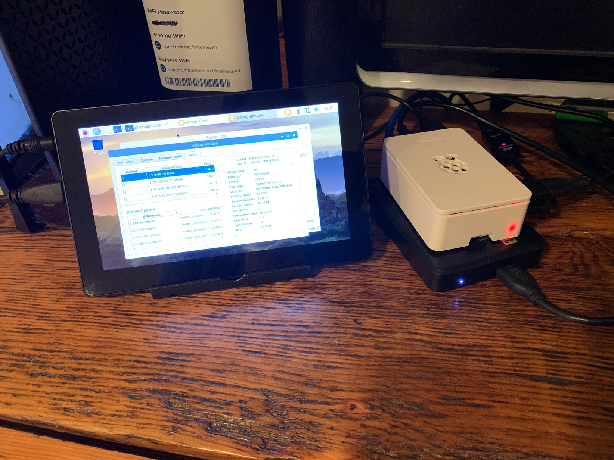

# Build your own Bitcoin full node on a RaspberryPi.
These are the steps I took to build a fully validating Bitcoin node running BitcoinCore-qt.

### Cautionary note:

https://ownyourbits.com/2019/02/02/whats-wrong-with-the-raspberry-pi/

If you value privacy and do not want the NSA to have access to your Bitcoin node, read this article and take this information into consideration. There is a potential backdoor to the Raspberry Pi's and if you want to build something on this hardware you should be aware of this potential risk. I have not confirmed this risk personally but it is worth considering. Thank you [@LukeDashjr](https://www.twitter.com/lukedashjr) for sharing this article with me.
